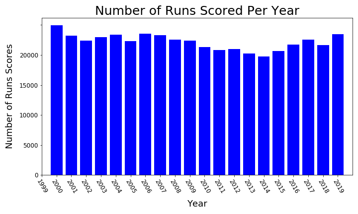
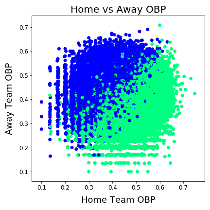
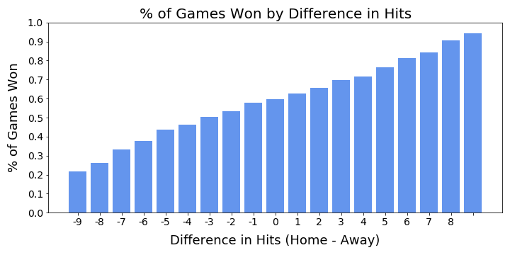

# Betting-Bank

**Authors**: [Justin Fernandez](mailto:justin_miguel_fernandez@gmail.com)

## Problem Overview
Major League Baseball(MLB) has been organizing and playing professional baseball since 1903 and will continue to do so for the foreseable future. With this many years and hundreds of thousands of games played there must be a way to predict who is going to win each game with a high degree of accuracy. With sports betting becoming more popular throughout the United States in the past 10 years due to legalization in many states, there is even more of a push to find a way to predict the outcome of these games. This project seeks to answer what factors lead to a team winning and also building a model that can predict the outcome.

## Business Case

## The Data
The dataset used in this project was created through the use of [retrosheet.org](https://www.retrosheet.org/) as it has one of the largest collection of MLB statistics and records from the past 100+ years of play. The collected statistics try and capture what happened in the game in terms of batting, fielding, and pitching and can give an indication as to why one team performed better than the other.

The dataset includes features about how each team perfomed in every game leading up to the game that we are predicting the outcome of. This inlcudes features on how that team has batted with statistics like batting average, on base percentage, and commonly recorded statistics like hits, singles, doubles, and many more. Pitching statistics are also being used such as earned runs average, number of pitchers used, and strikeouts. Lastly, fielding statsistics like putouts, assists, and passed balls are used round out the last aspect of the game.

Since the start of baseball, statisticians have been trying to create statistics that capture more information on what is happening in the game than the standard ones. A revolutionary set of statistics created by the [Society for American Baseball Research](https://sabr.org/sabermetrics) (SABR), known as sabermetrics, have been the most impactful to the understanding of baseball. These include weighted on base percentage, fielding independent pitching, batting average on balls in play, and many more.

## Modeling
Working to produce a model that has the highest possible accuracy allowed the testing and use of models with varying degress of interpretability. The metric of the model that will be focused on is accuracy as there is no differnece between false positve and false negatives. The predicitons will be whether the home team wins to not double count the games by predicting if the home and away team wins the same game. There is no class imabalance in this dataset as every team plays 162 games (81 home games) per year with less than 100 games out of 50,000 being cancelled and not rescheduled. The final model that achieved the highest accuracy was a logistic regression model that was grid searched to find the most optimal parameters. The final logistic regression model achieved an accuracy of 57%. XGBoost and logistic regression give feature importance for each feature allowing us to identify the features that impact the outcome of the game the most. Here are those features:

## Conclusions & Next Steps
- The record of each team (home and away) play a major part in the outcome of the game as teams who are winning
	
- Intentional walks are almost always negative ROI due to the mean batting average being 0.259
	
- A team with a high percentage of putouts leads to the opposite team scoring much less increasing change of a win
	
- Going up against pitchers with low earned runs decreases chance of winning
	
- The higher percentage of runners you catch stealing takes away chance of scoring and increases chance of winning

These are just a couple takeaways from feature importances from the models. One thing to note is that there is no one statstic that can be used to make a large part of a prediction. It is the combination of many stats and how they differ from your opponent.

### Further Research
With more time I would have liked to develop the data set even further. As of now the teams average is the only thing considered for each of the statistics (mostly on batting). Expanding this to have features for each the players in the starting lineup would have been able to capture more information on why a team is performing well.

 

### Navigation
- `final_notebook.ipynb`: Final notebook containing complete anlysis and modeling
- `EDA_FE_notebook.ipynb`: Exploratory data analysis and feature engineering
- `modeling.ipynb`: Classification modeling for prediction of fire size
- `data`: Folder containing data using in repository
- `images`: Folder containing images used in repository